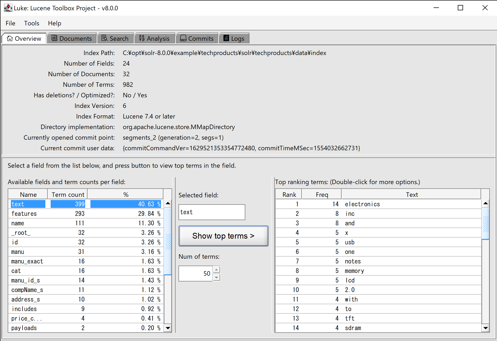

<!--
    Licensed to the Apache Software Foundation (ASF) under one or more
    contributor license agreements.  See the NOTICE file distributed with
    this work for additional information regarding copyright ownership.
    The ASF licenses this file to You under the Apache License, Version 2.0
    the "License"); you may not use this file except in compliance with
    the License.  You may obtain a copy of the License at

        http://www.apache.org/licenses/LICENSE-2.0

    Unless required by applicable law or agreed to in writing, software
    distributed under the License is distributed on an "AS IS" BASIS,
    WITHOUT WARRANTIES OR CONDITIONS OF ANY KIND, either express or implied.
    See the License for the specific language governing permissions and
    limitations under the License.
 -->

# Luke

## Introduction

Luke (atop Swing) is the GUI tool for introspecting your Lucene index. It allows:

* Browsing your documents, indexed terms and posting lists
* Searching in the index
* Performing index maintenance: index health checking, index optimization (take a backup before running this!)
* Testing your custom Lucene analyzer (Tokenizer/CharFilter/TokenFilter)

## Launching Luke

Using a binary release

The [Lucene Downloads](https://lucene.apache.org/core/downloads.html) page contains stable releases of Lucene including Luke. Download the respective release, unpack and run a shell or batch scripts inside the folder 'luke' (or directly with java -jar if you prefer it that way).

## Older releases

Older releases of Luke (prior to 8.1) can be found at https://github.com/DmitryKey/luke
